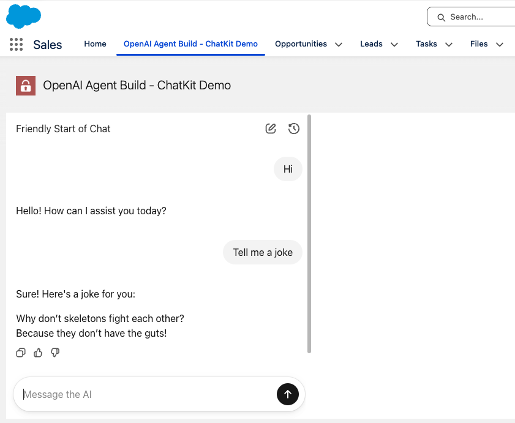

# OpenAI ChatKit Salesforce Example



>This project demonstrates how to integrate OpenAI's ChatKit with Salesforce using Lightning Web Components (LWC), Apex, and Named Credentials.

## Overview

This Salesforce DX project provides a proof-of-concept for embedding OpenAI ChatKit into Salesforce. It uses a custom LWC (`agentBuilderLWC`) and Apex controller (`AgentBuilderController.cls`) to securely create chat sessions and interact with OpenAI via Named Credentials.

## Main Components

- **Apex Controller**: `AgentBuilderController.cls` handles session creation.
- **LWC**: `agentBuilderLWC` loads the ChatKit widget and connects it to the backend via Apex.
- **Static Resource**: `chatkit.js` is the ChatKit widget loaded in the LWC.
- **Named Credential**: `openAI.namedCredential-meta.xml` securely stores API credentials for outbound calls.
- **Custom Object**: `Agent_Settings__c` stores configuration such as workflow IDs.


## Automated Scratch Org Setup & Deployment

You can automatically create a Salesforce scratch org and deploy all source code using the included script:

1. **Clone the repository**
2. **Authorize your Dev Hub org**
	```
	sf org login web --set-default-dev-hub --alias MyHub
	```
3. **Create and deploy to a scratch org**
	```
	npm run scratch:deploy
	```
	This will:
	- Create a scratch org using the definition in `config/project-scratch-def.json`
	- Deploy all source code
	- Assign the required permission set
	- Open the org in your browser

4. **Configure Named Credential**
	- Update `openAI.namedCredential-meta.xml` with your OpenAI API credentials (see below).
5. **Assign permissions**
	- Ensure users have access to the custom object and Apex class.
6. **Add the LWC to a Lightning page**
	- Drag `agentBuilderLWC` onto your desired Lightning page.

## Usage

Once deployed, users can interact with the ChatKit widget directly in Salesforce. The widget uses the Apex controller to create secure sessions and communicate with OpenAI.

## Project Structure

- `force-app/main/default/classes/AgentBuilderController.cls`: Apex backend logic
- `force-app/main/default/lwc/agentBuilderLWC/`: LWC frontend
- `force-app/main/default/staticresources/chatkit.js`: ChatKit widget
- `force-app/main/default/namedCredentials/openAI.namedCredential-meta.xml`: API credentials
- `force-app/main/default/objects/Agent_Settings__c/`: Custom setting for configuration

## Testing & Development

- Run unit tests with:
  ```
  npm run test:unit
  ```
- Lint and format code:
  ```
  npm run lint
  npm run prettier
  ```

## Resources

- [OpenAI ChatKit Documentation](https://openai.github.io/chatkit-js/)
- [Salesforce DX Documentation](https://developer.salesforce.com/tools/vscode/)

---
For questions or contributions, please open an issue or pull request.


## Steps to Setup OpenAI Integration

1. Make sure you have an OpenAI Account and have deployed an Agent Builder.
2. Deploy an Agent Builder and copy the workflow ID. Fill it in on the Agent Builder custom setting (`Agent_Settings__c`).
3. Generate an OpenAI API key on your OpenAI profile page. Copy the key and fill it in on the Named Credential under password using this format:
	- `Bearer {APIKEY}`
	- Do not use brackets around the API Key.
	- "Bearer" must be written exactly with a capital B and a space between Bearer and the APIKEY.
4. Add your scratch org or dev org domain as a whitelisted domain on your OpenAI profile page.

## Troubleshooting steps
1. Make sure OpenAI API key is entered on Named Credential
2. Make sure Agent Builder custom setting has your Workflow ID and that the workflow is Deployed
3. Make sure you have your org whitelisted on openAI or you will get a verification error. It can take 15 minutes for this to propogate
4. Make sure the CSP for the openAPI cdn is enabled, or you cannot use the iframe.
5. Make sure the Session settings in setup has `Turn on Trusted Mode for third-party static resources` and `Use Lightning Web Security for Lightning web components and Aura components`
